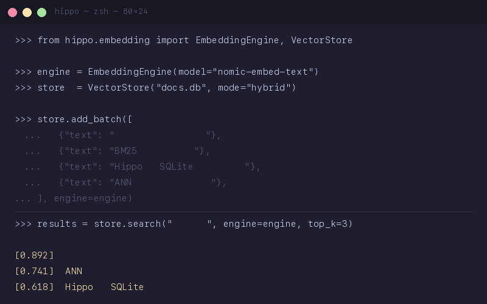
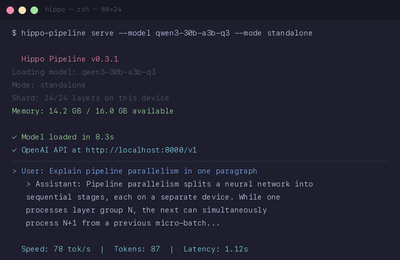

# Hippo 🦛

[](https://github.com/lawcontinue/hippo/actions/workflows/ci.yml)
[](https://pypi.org/project/hippo-llm/)
[](https://opensource.org/licenses/MIT)
[](https://www.python.org/downloads/)

`pip install hippo-llm` | [中文文档](./README_CN.md) | [Examples](./examples/)

Search your documents locally. BM25 works in 30 seconds, upgrade to hybrid when you need it.

No ChromaDB. No cloud API. No jieba. One `pip install`.

<p align="center">
  
  
</p>

## 30-second search

```python
from hippo.embedding import VectorStore

# sparse mode: BM25 only, zero extra dependencies
store = VectorStore("docs.db")  # default mode="sparse"

store.add_batch([
    {"text": "Pipeline parallelism splits layers across devices"},
    {"text": "BM25 handles exact keyword matches"},
    {"text": "Speculative decoding improves latency by 2-3x"},
])

results = store.search("how to run big models on small GPUs", top_k=5)
for doc in results:
    print(f"[{doc.score:.3f}] {doc.text}")
```

No external vector DB. No embedding model download. SQLite for persistence. Works offline immediately.

> **→ Need semantic search?** `pip install hippo-llm[embedding]` and switch to `mode="hybrid"` — same API, adds dense vectors + RRF fusion. [See hybrid example ↓](#full-rag-example-with-local-llm-hybrid-mode)

**Chinese-optimized**: Built-in tokenizer with stop words. No jieba dependency.

```python
store.add_batch([
    {"text": "管道并行将模型层拆分到多台设备上"},
    {"text": "混合搜索结合了关键词匹配和语义相似度"},
])
results = store.search("怎么在低端显卡上跑大模型", top_k=3)
```

<details>
<summary>Hybrid mode: BM25 + dense embedding with RRF fusion</summary>

```bash
pip install hippo-llm[embedding]
```

```python
from hippo.embedding import EmbeddingEngine, VectorStore

engine = EmbeddingEngine(model="nomic-embed-text")  # local, no API key
store = VectorStore("docs.db", mode="hybrid", embedding_engine=engine)

store.add_batch([
    {"text": "Pipeline parallelism splits layers across devices"},
    {"text": "BM25 handles exact keyword matches"},
], engine=engine)

# RRF fusion: BM25 exact match + semantic similarity
results = store.search("how to run big models on small GPUs", engine=engine, top_k=5)
for doc in results:
    print(f"[{doc.score:.3f}] {doc.text}")
```

</details>

<details>
<summary>Full RAG example with local LLM (hybrid mode)</summary>

```python
from hippo.embedding import EmbeddingEngine, VectorStore
import openai

# 1. Index documents (one-time)
engine = EmbeddingEngine(model="nomic-embed-text")
store = VectorStore("knowledge.db", mode="hybrid", embedding_engine=engine)

documents = [
    "Hippo splits model layers across multiple devices using TCP.",
    "Each device only loads its shard of layers, reducing memory per device.",
    "The loop detector catches semantic repetition using Jaccard similarity.",
    "BM25 hybrid search combines keyword matching with semantic similarity.",
]
store.add_batch([{"text": d} for d in documents], engine=engine)

# 2. RAG query
query = "how does hippo handle memory?"
results = store.search(query, engine=engine, top_k=2)
context = "\n".join(doc.text for doc in results)

# 3. Generate answer with local LLM
client = openai.OpenAI(base_url="http://localhost:8000/v1", api_key="none")
response = client.chat.completions.create(
    model="qwen3-30b-a3b-q3",
    messages=[
        {"role": "system", "content": f"Answer based on this context:\n{context}"},
        {"role": "user", "content": query}
    ]
)
print(response.choices[0].message.content)
```

</details>

## Why Hippo for embedding?

Every RAG pipeline, semantic router, and agent memory layer needs embeddings. Most people call cloud APIs (OpenAI, Cohere) and pay per token. Hippo runs everything locally.

| Problem | Hippo's answer |
|---------|---------------|
| Cloud embedding APIs: latency + cost + privacy | Local embedding, zero network calls |
| Installing ChromaDB + connector + embedding model separately | `VectorStore(mode="hybrid")` — one class, SQLite-backed |
| Chinese search needs jieba + extra config | Built-in tokenizer, zero config |
| BM25 vs dense — which to pick? | RRF fusion combines both, no choosing needed |
| >10K documents? | ANN index, sub-ms queries |
| Pipeline parallelism for big models | Split any GGUF across machines (Mac + PC mixed) |

**Real numbers from production use**:

| Metric | Value |
|--------|-------|
| BM25 query latency | <1ms |
| Dense search (bge-small-zh, 512d) | 5ms |
| Hybrid RRF fusion | <1ms overhead |
| ANN index build (10K docs) | ~2s |
| OOD accuracy (110 queries) | 85.5% top-1 (bge-small-zh), 92.7% (bge-m3) |
| Keyword + embedding fusion | 91.8% top-1 (互补, TOOLS #94) |

## Inference: run big models on cheap hardware

```bash
hippo-pipeline serve --model qwen3-30b-a3b-q3 --mode standalone
# → OpenAI-compatible API at localhost:8000/v1/chat/completions
```

<details>
<summary>Two-machine pipeline parallelism</summary>

```bash
# Machine 1
hippo-pipeline serve --model gemma-3-12b --mode pipeline --rank 0

# Machine 2
hippo-pipeline serve --model gemma-3-12b --mode pipeline --rank 1 \
  --coordinator http://192.168.1.10:9000
```

Split the model across machines. Plain TCP, no MPI. Mac + PC mixed.

</details>

## What's inside

| Feature | Details |
|---------|---------|
| **Embedding + Hybrid Search** | Dense + BM25 + RRF fusion. SQLite-backed, sub-ms queries. |
| **Chinese-optimized BM25** | Built-in tokenizer with stop words. No jieba needed. |
| **ANN Index** | Approximate nearest neighbor for large collections (>10K docs). |
| **Pipeline Parallelism** | Split any GGUF model across N machines. Mac + PC mixed. |
| **Loop Detection** | Jaccard-similarity detector catches semantic repetition. |
| **OpenAI-Compatible API** | Drop-in `/v1/chat/completions`. Works with LangChain, LlamaIndex. |
| **Auto Memory Budget** | Calculates shard splits from available VRAM automatically. |

## When to use Hippo

| You want... | Use this |
|-------------|----------|
| Search documents in 30 seconds | `VectorStore("docs.db")` — BM25, zero config |
| Search Chinese documents | Built-in tokenizer, zero config |
| Agent memory / semantic routing | `pip install hippo-llm[embedding]` → hybrid RRF |
| Local inference on one machine | `--mode standalone` with any GGUF model |
| Run a model too big for one device | `--mode pipeline` across 2+ machines |

## Install

```bash
pip install hippo-llm
```

Zero dependencies beyond numpy. BM25 search works immediately.

```bash
pip install hippo-llm[embedding]  # add dense vectors + hybrid RRF fusion
```

Requirements: Python 3.10+. Dense embedding needs a local model (via [Ollama](https://ollama.ai) or sentence-transformers cache).

## Roadmap

- **v0.3**: ANN index + Chinese tokenizer + hybrid RRF + sparse default ✅
- **v0.4**: Built-in embedding models (bge-small-zh 5ms sweet spot), reranker, real-time routing (<10ms)
- **v0.5**: Agent memory layer (embedding-backed episodic memory)
- **v0.6**: Multi-shard support (>2 devices), speculative decoding

## Benchmarks

| Setup | Model | Speed |
|-------|-------|-------|
| Mac Mini M2 (16GB) | Qwen3-4B-Q4 | 41 tok/s |
| RTX 5060 Ti (16GB) | Qwen3-14B-Q4 | 41 tok/s |
| 2× Mac Mini (16GB each) | Qwen3-30B-A3B-Q3 | 78 tok/s |
| Mac Mini M2 (16GB) | Qwen3-30B-A3B-Q3 | 24 tok/s |

## License

MIT

## Author

lawcontinue — [GitHub](https://github.com/lawcontinue)
